# PhD in AI & Autonomous Systems

<h1>PhD Researcher × AI Engineer × Software Engineer</h1>

<h3>6+ Years Engineering Experience · Research to Production</h3>

 

  

---
# ◉ AGENTIC INTELLIGENCE

```mermaid
flowchart LR
    G((Goal)) --> P[Planner / Router]
    P --> K[Context / RAG]
    P --> A[Specialist Agents]
    K --> A
    A --> T[Tools / APIs]
    T --> O[Observation]
    O --> M[(Memory)]
    M --> V[Evaluator / Critic]
    V -->|refine| P
    V -->|validated| X[Autonomous Action]
    X --> D[Production System]
    D --> E[Telemetry / Evaluation]
    E -. feedback .-> P

    classDef input fill:#0F172A,stroke:#22D3EE,color:#E2E8F0,stroke-width:2px;
    classDef brain fill:#1E1B4B,stroke:#818CF8,color:#F8FAFC,stroke-width:2px;
    classDef agent fill:#2E1065,stroke:#A78BFA,color:#F8FAFC,stroke-width:2px;
    classDef memory fill:#164E63,stroke:#67E8F9,color:#F8FAFC,stroke-width:2px;
    classDef action fill:#052E16,stroke:#34D399,color:#ECFDF5,stroke-width:2px;
    classDef eval fill:#3F1D2E,stroke:#F472B6,color:#FDF2F8,stroke-width:2px;

    class G input;
    class P,K brain;
    class A,T agent;
    class O,M memory;
    class X,D action;
    class V,E eval;
```

---

<table width="100%">
<tr>
<td width="50%" valign="top">
<h2>🧠 RESEARCH</h2>
<b>PhD — AI & Autonomous Systems</b> 
<b>SEECS · NUST</b>  
AI research at the intersection of <b>agentic systems, autonomous decision-making, multimodal intelligence and robotics</b>.  
<code>Multi-Agent Systems</code> · <code>VLMs</code> · <code>Autonomy</code> 
<code>Planning</code> · <code>Reasoning</code> · <code>Evaluation</code> 
<code>Robotics</code> · <code>Human-in-the-Loop</code>
</td>
<td width="50%" valign="top">
<h2>⚙️ ENGINEERING</h2>
<b>6+ years · 100+ production projects</b>  
Engineering intelligent products from <b>architecture and APIs</b> to <b>mobile/web, cloud infrastructure, deployment and observability</b>.  
<code>Python</code> · <code>TypeScript</code> · <code>FastAPI</code> · <code>Node.js</code> 
<code>React</code> · <code>Next.js</code> · <code>React Native</code> 
<code>MongoDB</code> · <code>PostgreSQL</code> · <code>AWS</code> · <code>Docker</code>
</td>
</tr>
</table>

---

 

  

<code>AI Research</code> → <code>Reasoning</code> → <code>Autonomy</code> → <code>Software Systems</code> → <code>Production</code> → <code>Evaluation</code>

---

# ⚡ GITHUB ENGINEERING ACTIVITY

Production engineering · research code · AI systems · continuous building

  

 

---
---

---

# 🚀 SELECTED SYSTEMS

Representative production work · <a href="https://www.devzona.com/portfolio">Explore full DevZona portfolio →</a>

<table width="100%">
<tr>
<td width="33%" valign="top"><h3>🧠 <a href="https://www.devzona.com/portfolio/evala-ai-1">Evala.ai</a></h3><b>AI Venture Intelligence</b> Pitch-deck analysis, scoring and AI-assisted decision workflows.</td>
<td width="33%" valign="top"><h3>✦ <a href="https://www.devzona.com/portfolio/pitchperfecter-ai-2">PitchPerfecter.ai</a></h3><b>Generative AI</b> Document intelligence and founder-facing AI analysis workflows.</td>
<td width="33%" valign="top"><h3>🔐 <a href="https://www.privacybot.com/">PrivacyBot</a></h3><b>AI Privacy SaaS</b> Automation-oriented privacy and data-removal workflows.</td>
</tr>
<tr>
<td width="33%" valign="top"><h3>📱 <a href="https://safegram.com/">Safegram</a></h3><b>Mobile Social Platform</b> Real-time product, privacy systems and backend architecture.</td>
<td width="33%" valign="top"><h3>⛽ <a href="https://www.fuelclubs.com/">Fuel Clubs</a></h3><b>Logistics Platform</b> Customer, operational and backend systems for fuel delivery.</td>
<td width="33%" valign="top"><h3>🤝 <a href="https://www.joinmentr.com/">Mentr</a></h3><b>Matching SaaS</b> Mentor–mentee matching and organizational workflows.</td>
</tr>
</table>

---

# 🧬 CORE TECHNOLOGY

 

  

### **Building intelligent systems that move from research ideas to production reality.**

 

