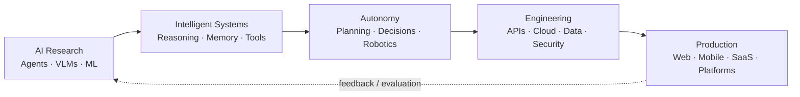

<div align="center">


### AI Researcher · Autonomous Systems · Agentic AI · Production Software Engineering

[](https://nust.edu.pk/)
[](https://seecs.nust.edu.pk/)
[](https://www.devzona.com/)
[](https://evolvion.io/)

<br/>


<br/>

[](mailto:hamza@devzona.com)
[](https://www.linkedin.com/in/hamza-khan22/)
[](https://github.com/HAMZA-420)
[](https://x.com/crypto__vr)
[](https://www.devzona.com/portfolio)


</div>

---

## `01.` Research + Engineering Identity

I am a **PhD Researcher in AI & Autonomous Systems at SEECS, NUST**, a **Software Engineer**, and a builder of production-grade intelligent systems.

My work sits at the intersection of **Artificial Intelligence, autonomous decision-making, multi-agent systems, multimodal / vision-language intelligence, robotics, cloud-native software, and scalable product engineering**.

I am particularly interested in research that does not stop at a paper or prototype: I like taking intelligent-system ideas through **architecture, experimentation, evaluation, APIs, infrastructure, deployment, observability, and real-world use**.

> **Research → Systems → Autonomy → Production**



---

## `02.` Current Focus

<table>
<tr>
<td width="50%" valign="top">

### 🎓 Research

* **AI & Autonomous Systems**
* **Agentic AI & Multi-Agent Systems**
* **Vision-Language / Multimodal AI**
* **Autonomous reasoning & decision systems**
* **Robotics & intelligent agents**
* **Geospatial / spatial intelligence**
* **Evaluation, reliability & human-in-the-loop AI**

</td>
<td width="50%" valign="top">

### ⚙️ Engineering

* Production-grade **LLM systems**
* **RAG**, semantic retrieval & vector search
* Tool-use / function-calling agents
* Multi-tenant **SaaS architectures**
* Distributed APIs, workers & background jobs
* Mobile + web product engineering
* Cloud deployment, security & observability

</td>
</tr>
</table>

---

## `03.` What I Build

```text
┌─────────────────────────────────────────────────────────────────────┐
│  INTELLIGENT SYSTEMS                                                │
│  Agentic AI · Multi-Agent Orchestration · RAG · VLMs · Automation  │
├─────────────────────────────────────────────────────────────────────┤
│  AUTONOMOUS SYSTEMS                                                 │
│  Planning · Tool Use · Decision Loops · Robotics · Human-in-Loop    │
├─────────────────────────────────────────────────────────────────────┤
│  SOFTWARE SYSTEMS                                                   │
│  SaaS · APIs · Mobile · Web · Real-Time · Multi-Tenant Platforms   │
├─────────────────────────────────────────────────────────────────────┤
│  CLOUD / PRODUCTION                                                 │
│  AWS · Docker · CI/CD · Storage · Queues · Observability · Scale    │
└─────────────────────────────────────────────────────────────────────┘
```

---

## `04.` Agentic AI Systems

I work beyond basic chatbot wrappers and single-pass prompting, with emphasis on **system architecture, controllability, evaluation, reliability, and production behavior**.

**Agent architecture**

`Tool Use` · `Function Calling` · `Task Routing` · `Planning` · `Agent Handoffs` · `Controller/Worker Patterns` · `Memory` · `Reflection / Evaluator Loops` · `Structured Outputs` · `Retries & Fallbacks` · `Human Review`

**Knowledge & intelligence**

`RAG` · `Vector Search` · `Semantic Retrieval` · `Document Intelligence` · `Multimodal Inputs` · `Knowledge Grounding` · `Web/External Tool Integration` · `Context Engineering`

**Production AI**

`Evaluation` · `Guardrails` · `Tracing` · `Telemetry` · `Caching` · `Rate Limits` · `Cost Controls` · `Provider Fallbacks` · `Background Workers` · `Security` · `RBAC` · `Multi-Tenant Isolation`

---

## `05.` Selected Production Work

> A few representative systems. More work is available on the **[DevZona Portfolio →](https://www.devzona.com/portfolio)**.

| Project                                                 | Area                                  | Engineering / Product Focus                                                                               |
| ------------------------------------------------------- | ------------------------------------- | --------------------------------------------------------------------------------------------------------- |
| **[Evala.ai](https://evala.ai/)**                       | AI / Venture Intelligence             | AI-assisted pitch-deck analysis, scoring, structured evaluation workflows and decision support            |
| **[PitchPerfecter.ai](https://www.pitchperfecter.ai/)** | Generative AI / Document Intelligence | Pitch-deck intelligence, feedback, analysis and founder-facing AI workflows                               |
| **[Safegram](https://safegram.com/)**                   | Mobile / Social Platform              | Production mobile social platform with privacy, real-time interactions, trust and marketplace features    |
| **[Fuel Clubs](https://www.fuelclubs.com/)**            | On-Demand / Logistics                 | Fuel-delivery platform spanning customer experience, operational workflows and production backend systems |
| **[PrivacyBot](https://www.privacybot.com/)**           | AI / Privacy SaaS                     | AI-powered privacy and data-removal workflows with automation-oriented product architecture               |
| **[Mentr](https://www.joinmentr.com/)**                 | Matching / SaaS                       | Mentor–mentee matching, program workflows and organizational dashboards                                   |
| **[Light Track](https://lighttrack.vercel.app/)**       | Vertical SaaS                         | Lighting specification and project workflow platform for structured product discovery                     |

<details>
<summary><b>More delivery snapshots</b></summary>
<br/>

`Spectrum` · `Front Dashboard` · `Auto Auctions` · `Holorent` · `Video Agency` · `Gym / Fitness` · `Chickanji` · `Property Rental` · `Aussie Amped` · `Novassor` · `TacticalCentre` · `MadmenAI GPT` · `Shouty` · and other production systems.

**Explore:** [devzona.com/portfolio](https://www.devzona.com/portfolio)

</details>

---

## `06.` Technology Stack

<div align="center">

### Languages · AI · Backend · Frontend · Cloud


<br/><br/>


</div>

### Engineering depth

| Layer            | Technologies / Competencies                                                                                                       |
| ---------------- | --------------------------------------------------------------------------------------------------------------------------------- |
| **AI / ML**      | LLM integrations, agentic workflows, multi-agent systems, RAG, vector databases, PyTorch, Keras/TensorFlow, OpenCV, multimodal AI |
| **Backend**      | Node.js, Express, Python, FastAPI, REST APIs, authentication, RBAC, queues, workers, webhooks, real-time systems                  |
| **Frontend**     | React, Next.js, TypeScript, React Native, modern state management, responsive product UI                                          |
| **Data**         | MongoDB, SQL/PostgreSQL, Redis, vector stores, structured/unstructured data pipelines                                             |
| **Cloud**        | AWS, S3, EC2, CloudFront, Docker, CI/CD, serverless patterns, production deployments                                              |
| **Architecture** | Multi-tenant SaaS, scalable APIs, caching, rate limiting, observability, security, resilient integrations                         |

---

## `07.` Education

<table>
<tr>
<td>

### 🎓 PhD — AI & Autonomous Systems

**School of Electrical Engineering & Computer Science (SEECS), NUST**

Research direction: intelligent and autonomous systems, agentic AI, multi-agent architectures, multimodal intelligence and deployable AI systems.

</td>
</tr>
<tr>
<td>

### 🎓 MS — Software Engineering

**National University of Sciences & Technology (NUST)**

</td>
</tr>
<tr>
<td>

### 🎓 BS — Software Engineering

**COMSATS University Islamabad**

</td>
</tr>
</table>

---

## `08.` Engineering Track Record

* **5+ years** building software products and intelligent systems
* **100+ substantial projects** delivered across freelance, startup and direct-client work
* Repeated **5-star client delivery** across production software engagements
* Experience owning systems from **requirements → architecture → development → deployment → iteration**
* Hands-on across **AI, backend, frontend, mobile, databases, cloud, infrastructure and product engineering**
* Comfortable moving between **research prototypes** and **production constraints**

---

## `09.` GitHub Engineering Activity

<div align="center">


<br/>


<br/>


</div>

---

## `10.` Professional Roles

```yaml
name: Muhammad Hamza Khan

current:
  - PhD Researcher — AI & Autonomous Systems @ NUST SEECS
  - Founder & CEO @ DEVZONA
  - Co-Founder & Lead Backend Developer @ Evolvion.io

focus:
  research:
    - Agentic AI
    - Multi-Agent Systems
    - Autonomous Systems
    - Vision-Language / Multimodal AI
    - Robotics & Intelligent Agents

  engineering:
    - AI-Native Products
    - Distributed Backend Systems
    - Mobile & Web Platforms
    - Cloud Architecture
    - Production AI Infrastructure
```

---

## `11.` Collaboration

I am interested in serious conversations around:

* **AI / Autonomous Systems research collaboration**
* **Multi-agent and agentic AI architectures**
* **Applied AI R&D**
* **Research engineering**
* **Autonomous / robotic intelligence**
* **AI-native startup systems**
* **Senior software / AI engineering and technical leadership**

<div align="center">

### Build systems that can **reason, act, learn, and survive production.**

[](mailto:hamza@devzona.com)
[](https://www.linkedin.com/in/hamza-khan22/)
[](https://www.devzona.com/portfolio)


</div>
